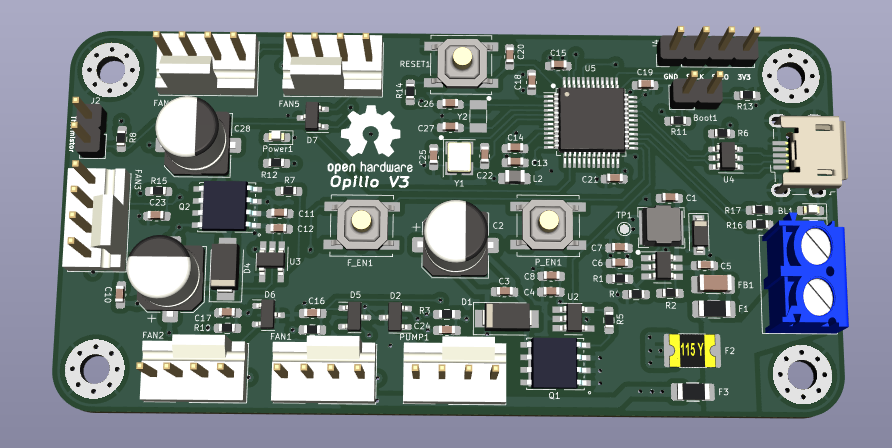

# opilio-firmware

Firmware for STM32F103C8 based custom board for PC wantercooling project.

Schema file can be found here [Schema](opilio_pcb/renders/schema.pdf)

Repository also contains KiCad [Project files](opilio_pcb/), if anyone would like to get the board printed by themselves.

